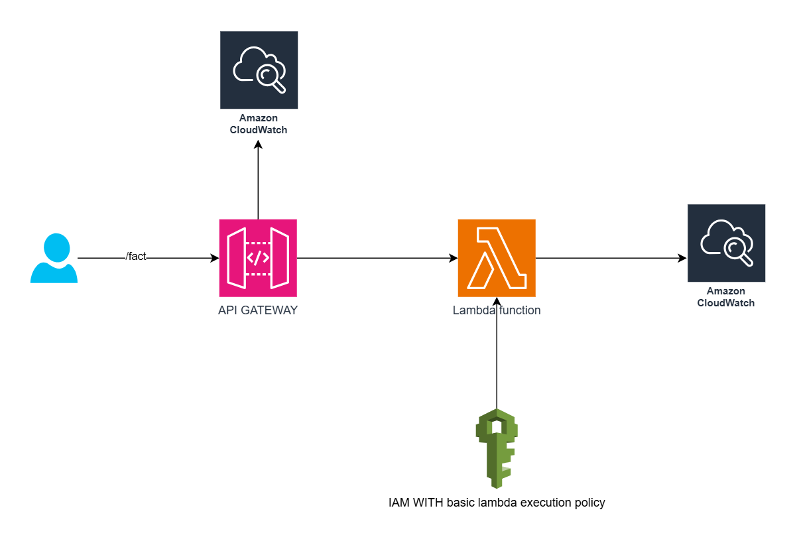

# Terraform API Gateway & Lambda Deployment

## Overview

This Terraform configuration sets up an AWS API Gateway and Lambda function. The API Gateway is configured with an HTTP endpoint that triggers a Lambda function, which returns a random cloud-related quote along with the current UTC timestamp.

The setup consists of two Terraform modules:
1. **API Gateway Module (`module/api-gateway`)**: Defines the API Gateway, integrations, routes, and logging.
2. **Lambda Module (`module/lambda`)**: Defines the Lambda function, IAM role, and permissions.

The `main.tf` file ties these modules together, passing the necessary variables and outputs between them.

## File Structure

```
.
├── module/
│   ├── api-gateway/
│   │   ├── api-gateway.tf
│   │   ├── output.tf
│   │   ├── vars.tf
│   ├── lambda/
│   │   ├── src/
│   │   │   ├── main.py
│   │   ├── iam.tf
│   │   ├── vars.tf
│   │   ├── output.tf
│   │   ├── lambda.tf
├── main.tf
├── variables.tf
├── providers.tf
```

## API Gateway Module (`module/api-gateway`)

Defines the API Gateway and its components:
- **API Gateway (`aws_apigatewayv2_api.fact`)**: Creates an HTTP API named `factAPI`.
- **Integration (`aws_apigatewayv2_integration.fact_routes`)**: Links API Gateway to the Lambda function.
- **Route (`aws_apigatewayv2_route.fact_route`)**: Configures the `GET /fact` route.
- **Stage (`aws_apigatewayv2_stage.default`)**: Deploys the API with automatic deployment and logging.
- **CloudWatch Log Group (`aws_cloudwatch_log_group.api_gateway_fact`)**: Stores API Gateway logs.

### Outputs

- `api_gateway_fact_execution_arn`: ARN of the API Gateway execution role.
- `address`: API Gateway URL.

## Lambda Module (`module/lambda`)

### `src/main.py`

The Lambda function generates a random cloud-related quote and returns it with the current UTC timestamp.

```python
import json
import random
from datetime import datetime

def lambda_handler(event, context):
    quotes = [
        "The cloud is about how you do computing, not where you do computing. - Paul Maritz",
        "Cloud is about elasticity, agility, and automation. - Satya Nadella",
        "The cloud is the future of business technology. - Marc Benioff",
        "There is no cloud, it's just someone else’s computer. - Unknown",
        "Move to the cloud, but do it wisely. - Werner Vogels",
        "Cloud computing is empowering. - Jeff Bezos"
    ]

    current_date = datetime.utcnow().strftime('%Y-%m-%d %H:%M:%S')
    random_quote = random.choice(quotes)

    return {
        'statusCode': 200,
        'headers': {'Content-Type': 'application/json'},
        'body': json.dumps({
            'message': 'Current date and time',
            'date': current_date,
            'quote': random_quote
        })
    }
```

### IAM Role

- **IAM Role (`aws_iam_role.lambda_fact`)**: Allows Lambda to assume the role.
- **IAM Policy Attachment (`aws_iam_role_policy_attachment.lambda_basic_execution`)**: Grants basic execution permissions to Lambda.

### Outputs

- `lambda_arn`: Lambda function ARN.

## Main Configuration Files

### `main.tf`

Combines the API Gateway and Lambda modules:
```hcl
module "api_gateway" {
  source     = "./module/api-gateway"
  lambda_arn = module.lambda.lambda_arn
}

module "lambda" {
  source                           = "./module/lambda"
  api_gateway_fact_execution_arn = module.api_gateway.api_gateway_fact_execution_arn
}

output "api_gateway_url" {
  value = module.api_gateway.address
}
```

### `providers.tf`

Defines the AWS provider:
```hcl
provider "aws" {
  region = var.region
}
```

### `variables.tf`

Defines the AWS region variable:
```hcl
variable "region" {
  description = "The AWS region to deploy resources."
  default     = "us-east-1"
}
```

## Deployment Instructions

1. **Initialize Terraform**
   ```sh
   terraform init
   ```
2. **Plan the deployment**
   ```sh
   terraform plan
   ```
3. **Apply the changes**
   ```sh
   terraform apply -auto-approve
   ```

### Testing the API Gateway

Retrieve the API Gateway URL from the Terraform output:
```sh
echo $(terraform output api_gateway_url)
```

Make a request to the `/fact` endpoint:
```sh
curl -X GET $(terraform output api_gateway_url)/fact
```

## Cleanup

To remove the deployed infrastructure, run:
```sh
terraform destroy -auto-approve
```

## Conclusion

This Terraform setup provides a simple yet powerful way to deploy a serverless API using AWS Lambda and API Gateway. The modular structure ensures reusability and maintainability. 🚀